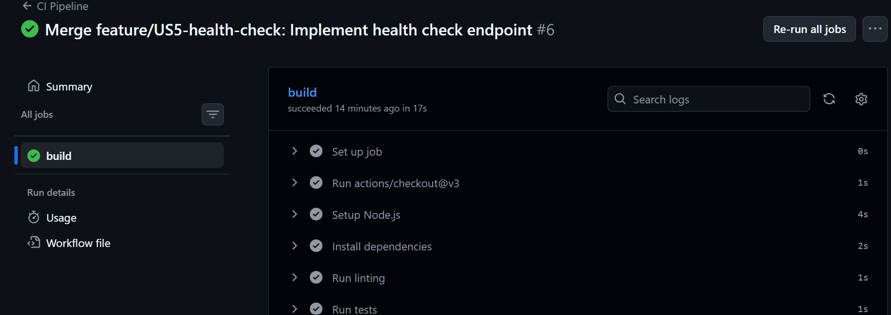
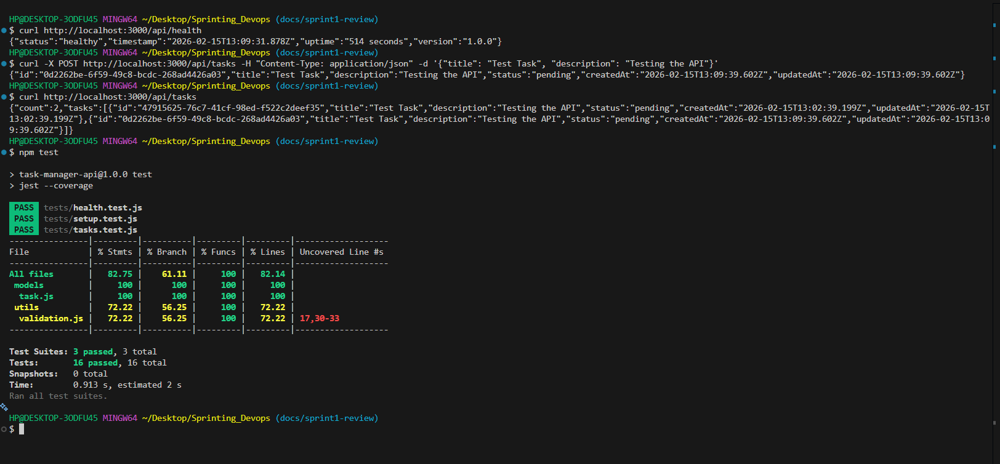

# Sprint 1 Review

## Sprint Goal
Deliver the core MVP functionality: ability to create and view tasks, plus establish CI/CD pipeline and health monitoring.

**Status:** ✅ COMPLETED

---

## Sprint Details

| Attribute | Value |
|-----------|-------|
| Sprint Number | 1 |
| Total Story Points | 6 |
| Completed Points | 6 |
| Start Date | February 15, 2026 |
| End Date | February 15, 2026 |

---

## Completed User Stories

### ✅ US1: Create Task (3 points)
**Acceptance Criteria Met:**
- [x] POST /api/tasks endpoint exists
- [x] Task must have a title (required)
- [x] Task can have an optional description
- [x] Task is created with status "pending" by default
- [x] API returns the created task with a unique ID
- [x] API returns 400 if title is missing

**Demo:**
```bash
curl -X POST http://localhost:3000/api/tasks \
  -H "Content-Type: application/json" \
  -d '{"title": "Buy groceries", "description": "Milk and eggs"}'
```

**Response:**
```json
{
  "id": "550e8400-e29b-41d4-a716-446655440000",
  "title": "Buy groceries",
  "description": "Milk and eggs",
  "status": "pending",
  "createdAt": "2026-02-15T10:30:00.000Z",
  "updatedAt": "2026-02-15T10:30:00.000Z"
}
```

---

### ✅ US2: View Tasks (2 points)
**Acceptance Criteria Met:**
- [x] GET /api/tasks endpoint returns all tasks
- [x] GET /api/tasks/:id returns a single task
- [x] API returns 404 if task ID not found
- [x] Response includes task id, title, description, status, createdAt

**Demo:**
```bash
curl http://localhost:3000/api/tasks
```

---

### ✅ US5: Health Check (1 point)
**Acceptance Criteria Met:**
- [x] GET /api/health endpoint exists
- [x] Returns status "healthy" when API is running
- [x] Returns uptime information
- [x] Response time is under 100ms

**Demo:**
```bash
curl http://localhost:3000/api/health
```

**Response:**
```json
{
  "status": "healthy",
  "timestamp": "2026-02-15T10:30:00.000Z",
  "uptime": "3600 seconds",
  "version": "1.0.0"
}
```

---

## Infrastructure Completed

- [x] Node.js project initialized
- [x] Express server running
- [x] ESLint configured (migrated to v9+ flat config)
- [x] Jest testing framework
- [x] GitHub Actions CI/CD pipeline
- [x] Pipeline runs on feature branches

---

## CI/CD Pipeline Status

✅ **Pipeline is operational**

Pipeline runs on:
- Every push to `main`
- Every push to `feature/**` branches
- Pull requests to `main`

Pipeline steps:
1. Checkout code
2. Setup Node.js 18
3. Install dependencies
4. Run linting
5. Run tests
6. Verify build

---

## Test Results

```
Test Suites: 3 passed, 3 total
Tests:       16 passed, 16 total
Coverage:    82.75%
```

---

## What Went Well

1. **CI/CD pipeline established early** - Caught ESLint config issue quickly
2. **Incremental commits** - Feature branch workflow working smoothly
3. **Test coverage** - Good foundation of unit tests

---

## Challenges Faced

1. **ESLint v9+ migration** - Required migration from `.eslintrc.json` to `eslint.config.js`
2. **Pipeline configuration** - Initial setup needed adjustments

---

## Screenshots

### Passing CI Pipeline


### API Responses


---

## Stakeholder Feedback

*To be gathered after demo*
